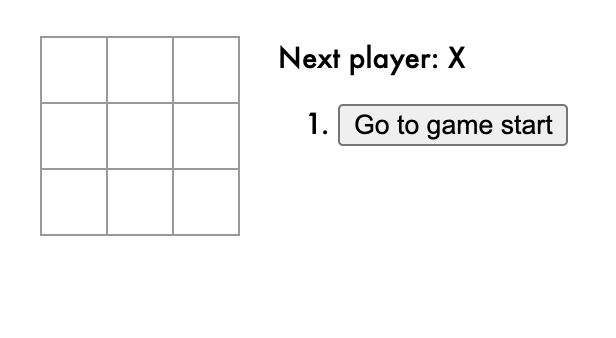

# Tic-tac-toe game
The game was developed by following the Intro to React Tutorial

## Purpose
The main purpose for this game is to familiarize with the React fundamentals.

## Technologies
- React
- JavaScript 
- HTML
- Node.js

## Demo

## Notes
For more information, refer to https://reactjs.org/tutorial/tutorial.html#setup-option-2-local-development-environment

Copyright (c) 2021 Facebook Inc.
